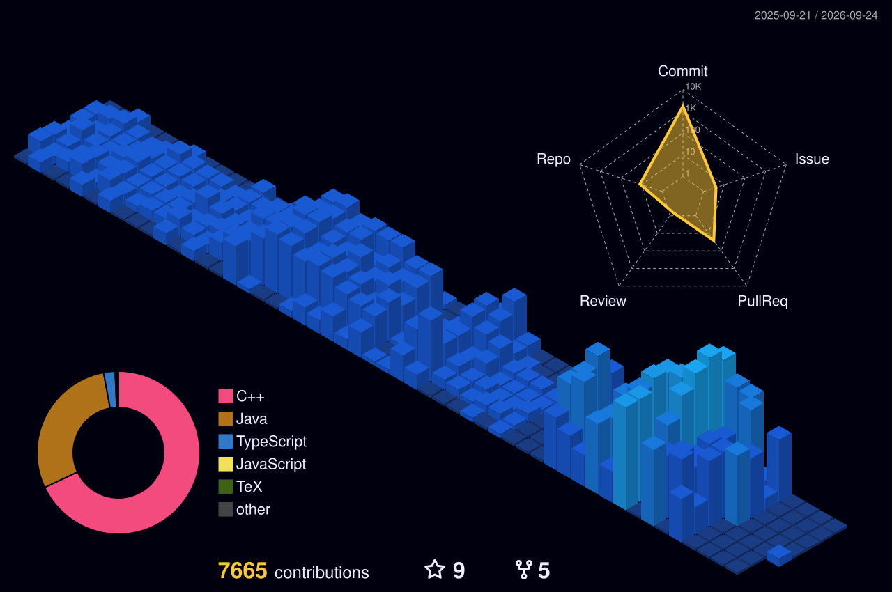

## Hi, I am Azhar! Great to see you here! 👋
 

<!-- 

  

 -->

 

## 📈 Statistics

	
  
  

 

## 📊 GitHub Contributions

  

 

<!-- ### Now Playing 🎧

  -->

<!--

 

## 📕 Pinned Repositories

	
	
	
	

