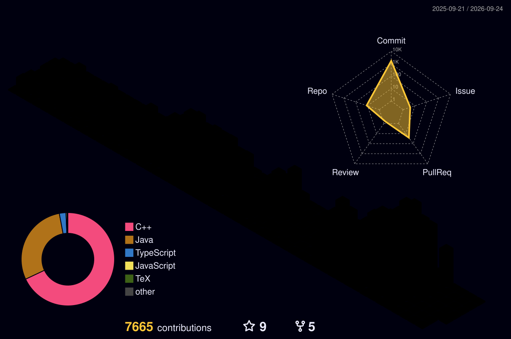

# 👋 Hi, I'm Azhar Sayyad

### Software Engineer building scalable SaaS & AI-powered applications

[;Passionate+about+clean+code+%26+scalable+systems)](https://git.io/typing-svg)

---

## 👨‍💻 About Me

- 🎯 Focused on **Full-Stack Development** and **AI-powered applications**
- 🧠 Practicing **Data Structures & Algorithms** regularly
- 🚀 Building products with **React, Next.js, Node.js & Java Spring Boot**
- 🤖 Exploring **LangChain, LLMs** and the modern AI tooling ecosystem
- 📬 How to reach me: **[Sayyad Azhar](https://www.linkedin.com/in/sayyad-azhar)**

---

## 🛠️ Tech Stack

  
  
  
  
   
  
  
  
  
  
   
  
  
  
  
   
  
  
  
  
  
  

---

## 📈 GitHub Stats

  
  
   
  

---

## 📊 3D GitHub Contributions

  

---

## 🚀 Featured Projects

  
  
  
  

  <b>➡️ <a href="https://github.com/azhar-sayyad?tab=repositories">View all my repositories</a></b>

---

## 🤝 Connect with Me

  
  
  

---

*"Code is like humor. When you have to explain it, it's bad." — Cory House*

⭐️ Thanks for stopping by! Have a great day!

